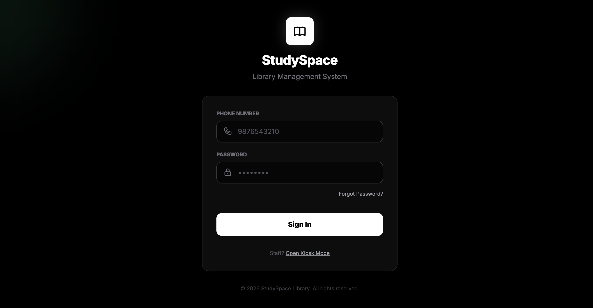
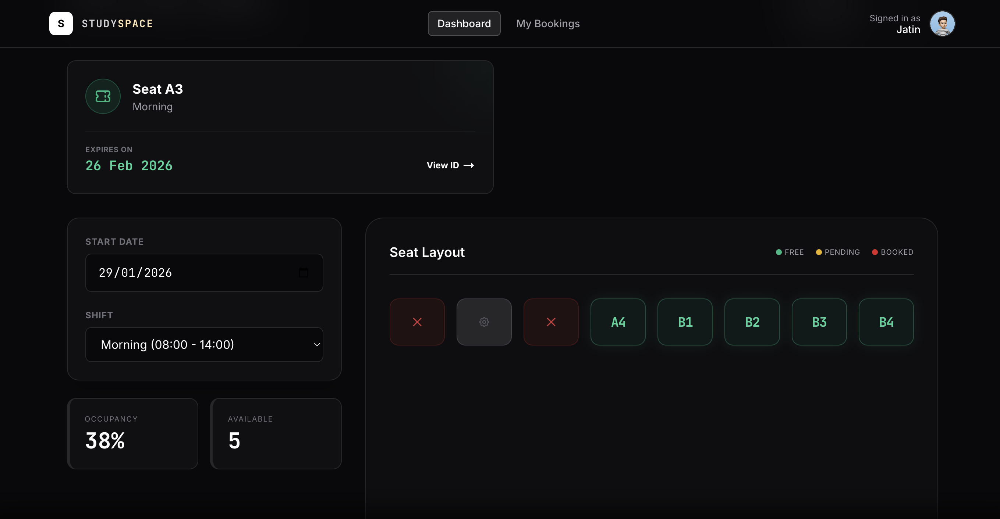
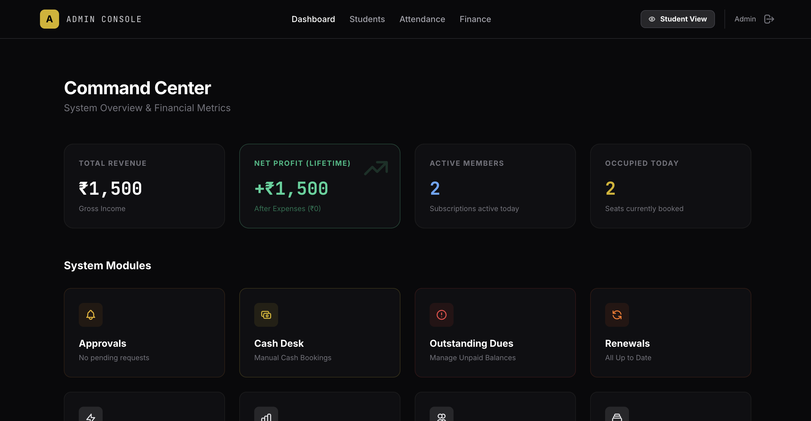
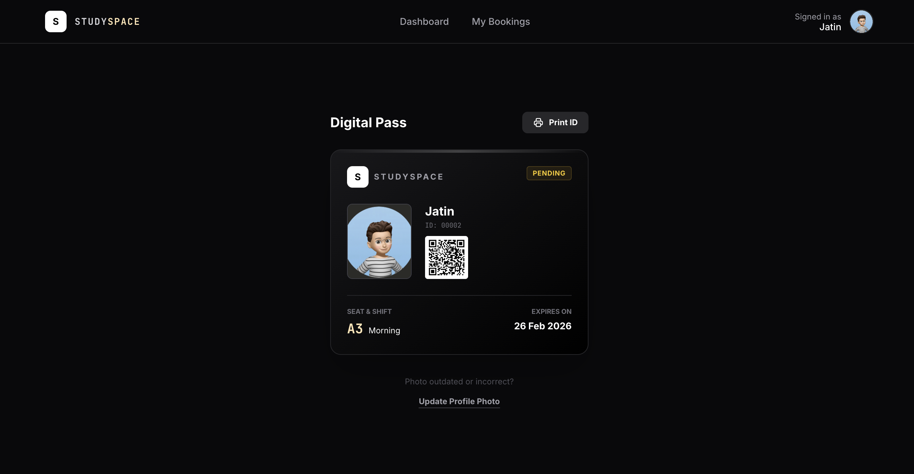
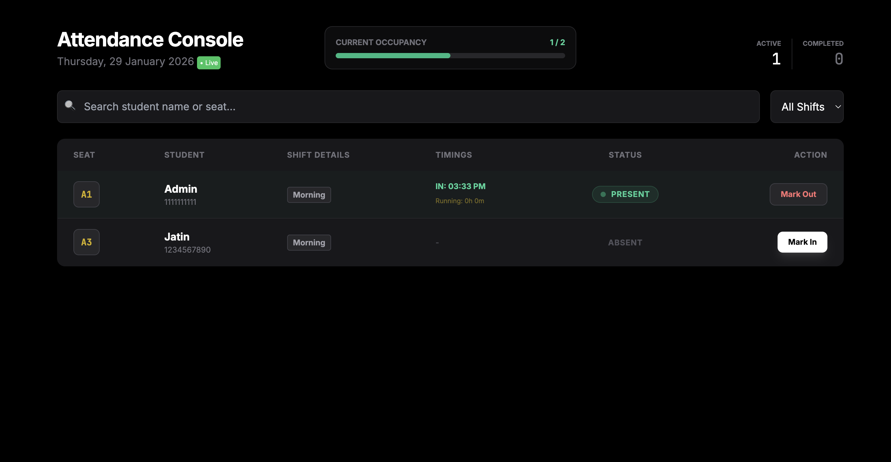

# StudySpace - Library (Seat) Management System


**StudySpace** is a comprehensive, full-stack Library & Co-working Space Operating System (OS). It features a dual-interface for Students and Administrators, enabling seamless seat booking, revenue tracking, and live operations management.

Built with **Core PHP**, **MySQL**, and **Tailwind CSS**. No heavy frameworks, just pure performance.

## 📸 Screenshots

|                 Student Dashboard                  |              Admin Command Center              |
| :------------------------------------------------: | :--------------------------------------------: |
|  |  |
|         _Visual Seat Map & Quick Actions_          |        _Revenue Analytics & Operations_        |

|               Digital ID Card               |                Live Attendance                 |
| :-----------------------------------------: | :--------------------------------------------: |
|  |  |
|            _QR-Based Entry Pass_            |         _Real-time Check-in/out Kiosk_         |

## 🚀 Getting Started

### Prerequisites

- PHP 8.0+
- MySQL 5.7+
- Apache/Nginx Server (XAMPP/MAMP recommended for local dev)

### Installation

1.  **Clone the Repository**

    ```bash
    git clone [https://github.com/jatinsne/studyspace.git](https://github.com/jatinsne/studyspace.git)
    cd studyspace
    ```

2.  **Setup Database**
    - Create a database named `library_db` in PHPMyAdmin or MySQL Workbench.
    - Import the `schema.sql` file located in the root directory.
    - _Note: This creates a default Admin user (Email: `admin@library.com`, Pass: `123456`)._

3.  **Configure Connection**
    - Open `library_system/config/Database.php`.
    - Update the `$user` and `$pass` variables to match your local database credentials.

4.  **Permissions**
    - Ensure the `uploads/` folder has write permissions for saving profile photos and ID proofs.
    - **Linux/Mac:** `chmod -R 777 library_system/uploads/`

5.  **Launch**
    - Open your browser and navigate to `http://localhost/studyspace/library_system/`.

## 🛠️ Tech Stack

- **Backend:** PHP (PDO, OOP Architecture)
- **Frontend:** HTML5, Tailwind CSS (via CDN), JavaScript (Vanilla)
- **Database:** MySQL / MariaDB
- **UI Libraries:** SweetAlert2 (Popups), HeroIcons (SVG)

## 🤝 Contributing

Contributions are welcome! Please fork the repository and create a pull request for any features or bug fixes.

1.  Fork the Project
2.  Create your Feature Branch (`git checkout -b feature/AmazingFeature`)
3.  Commit your Changes (`git commit -m 'Add some AmazingFeature'`)
4.  Push to the Branch (`git push origin feature/AmazingFeature`)
5.  Open a Pull Request

## 📄 License

Distributed under the MIT License. See `LICENSE` for more information.
